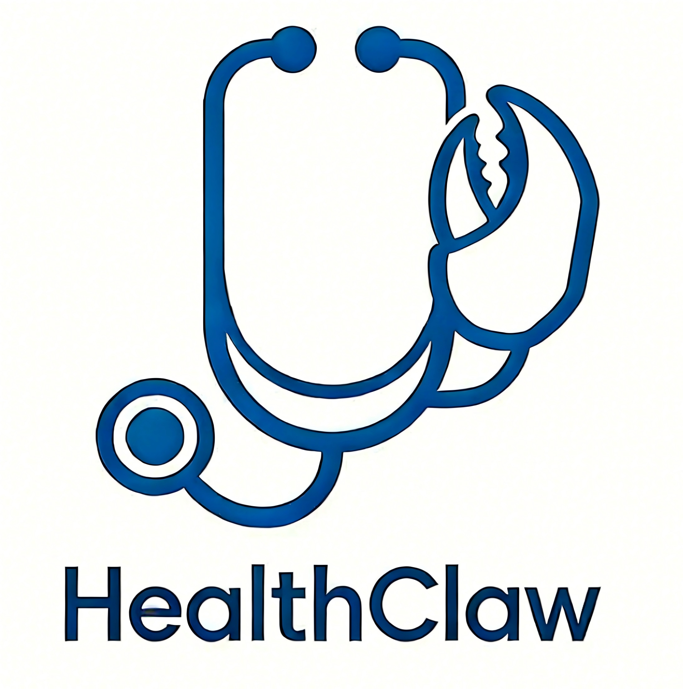

**Languages:** English | [简体中文](README.zh-CN.md)

<div align="center">

<h1>🩺 HealthClaw: Self-Evolving Personal Health Copilot</h1>

An open-source self-evolving agent stack for medical consultation support, personal health management, and multimodal health analytics

<br/>



<br/>
<br/>


<a href="./LICENSE"></a>

</div>

<br/>

> From a one-shot chat assistant to a **long-running health agent**:
>
> It spans daily monitoring, report interpretation, and chronic-care follow-up—personal health and cross-device workflows in one traceable pipeline: every action visible, every evidence cited, every conclusion explainable, every lesson retained.
>
> When needed, it can pull in clinical data, medical imaging, and omics evidence to support risk assessment and differential-style analysis—raising the systematic quality of decision support.
>
> **This system is for assistance only; it is not medical advice and does not replace professional care.**

---

## What’s new

- **March 22, 2026:** HealthClaw public release.

---

## Demos

### Meal planning and recommendations

<p align="center">
  <video
    poster="./docs/readme_media/meal_plan_recommendation_demo_cover.png"
    src="https://github.com/user-attachments/assets/8d0623d6-ffa8-4012-8f16-c8e8afc337d6"
    controls
    muted
    playsinline
    preload="metadata"
    width="800"
  >
    If the player does not appear, <a href="https://github.com/user-attachments/assets/8d0623d6-ffa8-4012-8f16-c8e8afc337d6">open the video directly</a>.
  </video>
</p>

<p align="left"><em>☝️ Want steadier eating this week without a few generic “eat less grease” lines in chat?<br/>
HealthClaw acts like a reliable meal buddy: you describe how you want to eat; it drafts a month-long plan;<br/>
when dinner time hits, it does not stop at one suggestion—it searches delivery apps, logs what happened, and pushes recommendations to chat while you make the call.</em></p>

<br/>

### One-click health analysis

<p align="center">
  <video
    poster="./docs/readme_media/one_click_health_demo_cover.png"
    src="https://github.com/user-attachments/assets/a3ae7af3-3176-475c-90a9-2dfc97c30a81"
    controls
    muted
    playsinline
    preload="metadata"
    width="800"
  >
    If the player does not appear, <a href="https://github.com/user-attachments/assets/a3ae7af3-3176-475c-90a9-2dfc97c30a81">open the video directly</a>.
  </video>
</p>

<p align="left"><em>☝️ Tired of hopping between apps and guessing from fragments? One-click analysis pulls the analyses you select over the days you choose, with optional subtasks;<br/>
it reads device-side data in order and produces one consolidated report—scores and highlights per pillar, cross-checks, and “watch these first / adjust this week” actions so scattered signals become your next concrete step.</em></p>

<br/>

### Disease risk assessment

<p align="center">
  <video
    poster="./docs/readme_media/showcase_risk_prediction_cover.png"
    src="https://github.com/user-attachments/assets/f096dd86-905e-451d-a577-b1d4e5613ebc"
    controls
    muted
    playsinline
    preload="metadata"
    width="800"
  >
    If the player does not appear, <a href="https://github.com/user-attachments/assets/f096dd86-905e-451d-a577-b1d4e5613ebc">open the video directly</a>.
  </video>
</p>

<p align="left"><em>☝️ Beyond “do I have it now,” many people care about “what should I guard against in the coming years.”<br/>
HealthClaw can connect case records to surface future risk in a clearer view from messy notes,<br/>
and support clinicians for deeper analysis—always as decision support, not a diagnosis.</em></p>

<p align="center">
  <a href="./docs/showcase/README.md">All demos</a>
</p>

---

## Capabilities at a glance

| Area | What it does |
|------|----------------|
| **Medical consultation support** | Daily monitoring, report reading, chronic-care tracking; optional fusion of clinical, imaging, and omics evidence for risk and differential-style reference.<br>(Not a substitute for care—evidence-first, care-seeking guidance.) |
| **Health analytics & planning** | Aggregate wearables and cross-device signals; anomaly alerts via Feishu and other channels.<br>Interpret diet and health goals; monthly and per-meal planning; optional phone search and push. |
| **Layered memory & self-evolution** | **L0** global behavior and write rules; **L1** disease/tool index for retrieval and routing; **L2** environment and long-term facts; **L3** domain flows and reusable scripts; **L4** runtime cases and episodic memory.<br>After tasks, episodes, distilled strategies, and self-evaluation make experience reusable. |
| **Multiple surfaces & models** | Streamlit, Feishu (Lark), CLI, and more; multiple LLM backends with automatic retry and fallback.<br>Health workflows can span time, devices, and roles with tool calls and auditable traces. |

---

## Architecture

> **Core loop:** `[personal health memory + multi-device data + scenario tasks]` → agent reasoning and tools → outputs (Web / Feishu / nodes) → five-layer memory and self-evolution.

```
  User · data · tasks
          │
          ▼
  ┌───────────────────────────────────────────┐
  │ Entry layer                               │
  │ Streamlit · Feishu · CLI · binding_cli    │
  └─────────────────────┬─────────────────────┘
                        │
                        ▼
  ┌───────────────────────────────────────────┐
  │ Agent core ( Think → Decide → Act )       │
  │ seda_main · agent_loop · ukb_handler      │
  └──────────┬───────────────────────┬────────┘
             │                       │
             ▼                       ▼
  ┌──────────────────────┐   ┌──────────────────────┐
  │ Tool layer           │   │ Browser bridge       │
  │ med · omics · imaging│   │ TMWebDriver · CDP ·  │
  │ wear · bioinfo ·     │   │ assets               │
  │ browser · phone      │   │                      │
  └──────────┬───────────┘   └──────────┬───────────┘
             │                          │
             └────────────┬─────────────┘
                          ▼
  ┌───────────────────────────────────────────┐
  │ MEMORY (L0–L4)                            │
  │ L0→L1→L2 · L3 scripts · L4 cases · data   │
  └──────────────────────▲────────────────────┘
                         │
                         │ write / distill
                         │
  ┌──────────────────────┴────────────────────┐
  │ EVOLUTION                                 │
  │ episode_writer · strategy_distiller ·     │
  │ self_evaluator                            │
  └───────────────────────────────────────────┘

  ┌───────────────────────────────────────────┐
  │ Reliability (cross-cutting)               │
  │ multi-backend retry · fallback · recovery │
  │ sidercall · ga                            │
  └───────────────────────────────────────────┘
```

---

## Quick start

### 1. Install base dependencies

```bash
pip install requests streamlit lark-oapi 
```

Beyond this minimal set, **install only what you enable**—you do not need everything at once:

| Capability | Notes |
|------------|--------|
| **Phone ADB (device control / on-device meal search, etc.)** | Install and configure `adb` on your PC; connect and authorize an Android device. See [ADB setup](./docs/adb/README.md). |
| **Feishu bot (`fsapp.py`)** | `lark-oapi` covers the SDK; create an app in the Feishu open platform, enable bot and events, and fill credentials in `mykey.py`. Full path from zero to alerts and device push: [Feishu bot guide](./docs/feishu/README.md). |
| **Browser automation** | e.g. Playwright—install per scripts and tools you use. |
| **Bioinfo / omics** | Prepare per submodule and external toolchain; reading PLINK `.bed` genotypes needs `bed-reader`. |

### 2. Configure models and secrets

Model quality strongly affects tool choice, memory writes, and task success; **when cost and latency allow, prefer stronger models** (and sized-to-hardware weights when local).

**Step 1: copy the template**

```bash
cp mykey_template.py mykey.py
```

**Step 2: fill API credentials in `mykey.py`**

Enable at least one LLM backend; see `mykey_template.py` for all keys. Most common: **OpenAI-compatible** APIs:

```python
oai_config = {
    'apikey': 'YOUR_API_KEY',
    'apibase': 'https://your-api-endpoint/v1',
    'model': 'gpt-5.4',
}
```

**Step 3: pick config keys by backend**

| Backend | Key | Notes |
|---------|-----|--------|
| OpenAI-compatible | `oai_config` | Any OpenAI-compatible API or proxy |
| Claude (Anthropic) | `claude_config` | Official Anthropic API |
| Gemini | `google_api_key` | Google Generative AI |
| Xai (Grok) | `xai_config` | via `xai_sdk` |
| Sider | `sider_cookie` | Browser cookie auth |
| Local | see step 4 | Any local OpenAI-compatible server |

Runtimes may auto-retry (e.g. 429/5xx backoff) and fall back across backends (see code).

**Step 4 (optional): local models**

```bash
export SEDA_LLM_MODE=local
export SEDA_LOCAL_API_BASE=http://localhost:8000/v1
export SEDA_LOCAL_MODEL_NAME=your-local-model
```

> **Never commit `mykey.py`** (templates are fine; real secrets stay local).

### 3. Run an entrypoint

After **§1** deps and **§2** keys, pick a surface. **Suggested order:** **Web UI → Feishu bot → CLI**.

**Step 1 (recommended): Web UI**

From the repo root (default local port is often `8501`—check the terminal):

```bash
streamlit run stapp.py
```

Good for local trials, UI debugging, and health flows without Feishu setup.

**Step 2: Feishu bot**

Requires `fs_app_id` / `fs_app_secret` in `mykey.py` and open-platform bot setup ([Feishu bot guide](./docs/feishu/README.md)):

```bash
python fsapp.py
```

For everyday messaging, alerts, and meal pushes inside Feishu.

**Step 3: CLI main agent**

Interactive main loop for scripting or headless environments:

```bash
python seda_main.py --verbose
```

---

## Notes

- Do not commit `mykey.py`.
- Feishu push, phone ADB, and browser bridges need prior setup and permissions.
- For real clinical decisions, treat this repo as analysis support—not a substitute for professionals.

---

## Roadmap

- Test and integrate **more LLM backends**; harden compatibility and fallback.
- Broaden **wearable** ingestion (more vendors, export formats, APIs).

---

## License

See `LICENSE` in the repository root.

---

## Acknowledgements

We are grateful for the following excellent projects. If you’re interested, please check them out.:

- **[GenericAgent](https://github.com/lsdefine/GenericAgent)** 
- **[OpenClaw](https://docs.openclaw.ai/zh-CN)** 
- **[OpenClaw Medical Skills](https://github.com/FreedomIntelligence/OpenClaw-Medical-Skills)** 


## Star History
[](https://star-history.com/#HC-Guo/HealthClaw&Date)
